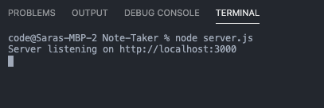
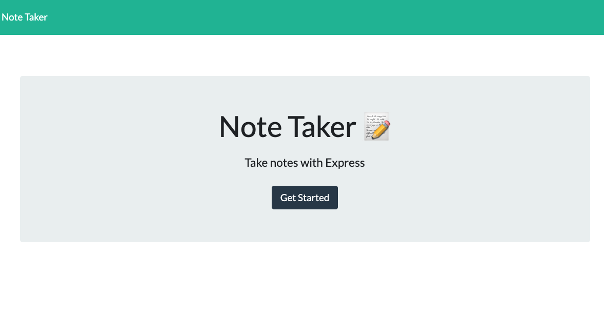

## Description

Created an application that can be used to write, save, and delete notes. This application will use an express backend and save and retrieve note data from a JSON file.

On this application you can come back to the server and view your previously saved notes. Upon clicking on the notes you can see the description inside. You may also choose which notes to delete by clicking the red trash icon next to the note.

## User Story

AS A user, I want to be able to write and save notes

I WANT to be able to delete notes I've written before

SO THAT I can organize my thoughts and keep track of tasks I need to complete

## Business Context

For users that need to keep track of a lot of information, it's easy to forget or be unable to recall something important. Being able to take persistent notes allows users to have written information available when needed.

## Usage

## Deployed App

https://sleepy-falls-90662.herokuapp.com/

- - -
© 2019 Trilogy Education Services, a 2U, Inc. brand. All Rights Reserved.
